# Chatbot Flow

Structure of the RadCrew `/chat` pipeline as it currently stands (FastAPI +
LangGraph + HuggingFace), including the deterministic pre-gate, the
semantic→lexical retrieval fallback, and the output sanitizer.

## 1. Request lifecycle (high level)

```mermaid
flowchart TD
    U([Client]) -->|"POST /chat&#10;{message, history}"| EP["chat endpoint&#10;(api/chat.py)"]
    EP --> GS["generate_chat_stream&#10;(chatbot/chat.py)"]
    GS -->|"HF_TOKEN missing"| UNAVAIL["MSG_AI_UNAVAILABLE"]
    GS -->|"invoke graph"| GRAPH[["LangGraph&#10;(see section 2)"]]
    GRAPH --> OS["output_stream"]
    UNAVAIL --> SSE
    OS --> SSE["SSE event_stream&#10;data: {type: chunk} … {type: done}"]
    SSE --> U

    subgraph startup["Startup — runs once (core/lifespan.py)"]
        LOAD["get_static_site_documents()&#10;+ get_resume_documents() from GitHub"] --> KC[("knowledge_chunks&#10;in-memory list")]
        KC --> IDX["index_documents()&#10;embed corpus once (HF)&#10;(knowledge/embeddings.py)"]
        IDX --> VEC[("document vectors&#10;L2-normalized, in-memory")]
    end
    KC -.->|"passed into graph state"| GRAPH
    VEC -.->|"reused by retrieval"| GRAPH
```

## 2. Routing graph (graph/build.py)

```mermaid
flowchart TD
    START((START)) --> ROUTE["route&#10;feedback_router_node"]

    ROUTE --> PRE{"pre-gate (Solution A)&#10;question & no&#10;feedback signal?"}
    PRE -->|"yes — skip LLM"| RAGN
    PRE -->|no| LLM["LLM classifier&#10;Qwen2.5-1.5B + JSON schema"]
    LLM --> TC{"tool_call returned?"}
    TC -->|"no / parse error"| RAGN
    TC -->|yes| FB["feedback&#10;feedback_handler_node"]

    FB --> SUBMIT["submit_feedback()&#10;Web3Forms POST"]
    SUBMIT -->|ok| THANKS["MSG_FEEDBACK_THANKS"]
    SUBMIT -->|error| SENDFAIL["MSG_FEEDBACK_SEND_FAILED"]
    THANKS --> ENDF((END))
    SENDFAIL --> ENDF

    RAGN["rag&#10;rag_answer_node&#10;(see section 3)"] --> ENDR((END))
```

Note: `feedback_handler_node` sends the email **immediately** — there is no
confirmation step yet (that is the proposed Solution D).

## 3. RAG answer pipeline (graph/nodes/rag_answer/)

```mermaid
flowchart TD
    IN["message + history"] --> Q["retrieval_query =&#10;message + last 2 user messages"]
    Q --> RET["retrieve_relevant_chunks(k=8)&#10;(retrieval.py)"]

    RET --> SEM["semantic similarities&#10;embed query only,&#10;cosine vs cached vectors&#10;(embeddings.py)"]
    SEM --> THR{"top score ≥ 0.25?"}
    THR -->|yes| TOPK["top-k semantic docs"]
    THR -->|"no / weak"| LEX["lexical fallback&#10;title-weighted token overlap"]

    TOPK --> CHK{"chunks found?"}
    LEX --> CHK
    CHK -->|"none & no history"| LOWCTX["MSG_FALLBACK_LOW_CONTEXT"]
    CHK -->|yes| PROMPT["build_chat_prompt&#10;→ ChatPrompt(system, user, history)&#10;(prompt.py)"]

    PROMPT --> CACHE{"response cached?&#10;sha256(system+history+user) (cache.py)"}
    CACHE -->|hit| CACHED["stream cached text"]
    CACHE -->|miss| GEN["generate_answer(system, user, history)&#10;(see section 4)"]
    GEN --> SAN["sanitize_answer_stream&#10;* → - , strip URLs/links (sanitize.py)"]
    SAN --> CACHEW["stream_answer_with_cache&#10;(yields chunks, stores result)"]
```

## 4. Generation with provider fallback (huggingface/)

```mermaid
flowchart LR
    GA["generate_answer(system, user, history)&#10;builds [system, *history, user] (generate.py)"] --> CC["stream_chat_completion(messages)&#10;per provider (chat_completion.py)"]
    CC -->|"yields tokens"| OUT(["answer token stream"])
    CC -->|"all providers fail / empty"| TG["stream_text_generation(messages)&#10;folds turns into one prompt (text_generation.py)"]
    TG -->|"yields tokens"| OUT
    TG -->|"all fail"| ERR["RuntimeError&#10;(caught upstream → MSG_AI_UNAVAILABLE)"]
```

Generation is deterministic: `temperature=0`, `top_p=1`, `do_sample=False`,
fixed `seed=42`.

## Embedding cache

Document embeddings are computed **once at startup** (`knowledge/embeddings.py`,
called from `core/lifespan.py`): the corpus is embedded via HF
`feature_extraction`, L2-normalized, and kept in an in-memory `id → vector`
store. Per request, retrieval embeds **only the query** and scores it locally
(cosine = dot product) against the cached vectors, so per-request embedding cost
is constant rather than scaling with the knowledge-base size. If embeddings are
unconfigured or the startup embed fails, the store stays empty and
`semantic_similarities` returns zeros, so retrieval falls back to the lexical
keyword path.

## Timing logs

Per-stage latency is logged at INFO so request cost is measurable:

| Log line | Stage |
|---|---|
| `[timing] retrieval=…s confidence=… chunks=…` | query embed + scoring |
| `[deepsearch] … elapsed=…s …` | web search (only when it fires) |
| `[timing] cache=hit chars=…` | cached response short-circuit |
| `[timing] generation ttft=…s` / `total=…s chars=…` | time-to-first-token + full stream |

Generation timing is measured from when the client starts consuming the stream
(`utils/streaming.py:timed_stream`), so it reflects real generation latency.

## File map

| Stage | File |
|---|---|
| HTTP endpoint + SSE framing | `app/api/chat.py` |
| Stream entry, HF_TOKEN guard | `app/chatbot/chat.py` |
| Knowledge load at startup | `app/core/lifespan.py`, `app/chatbot/knowledge/` |
| Embedding cache (startup index + query embed) | `app/chatbot/knowledge/embeddings.py` |
| Graph wiring | `app/chatbot/graph/build.py`, `graph/state.py` |
| Router + pre-gate | `graph/nodes/feedback_router/router.py`, `pregate.py`, `message.py`, `parse.py` |
| Feedback handler | `graph/nodes/feedback_handler/handler.py`, `submit.py` |
| Retrieval (semantic + lexical) | `graph/nodes/rag_answer/retrieval.py` |
| Per-stage timing logs | `graph/nodes/rag_answer/answer.py`, `utils/streaming.py` |
| Prompt (system/user) | `graph/nodes/rag_answer/prompt.py` |
| Response cache | `graph/nodes/rag_answer/cache.py` |
| Output sanitizer | `graph/nodes/rag_answer/sanitize.py` |
| HF generation | `app/chatbot/huggingface/` |

See [chatbot-improvements.md](chatbot-improvements.md) for the problems and
fixes behind this structure.
